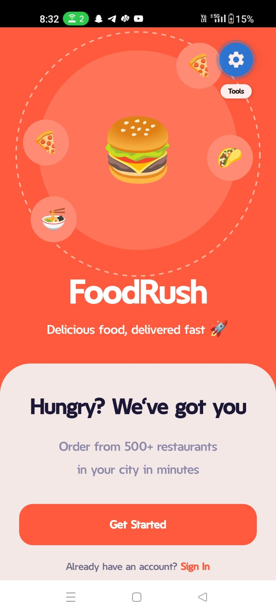
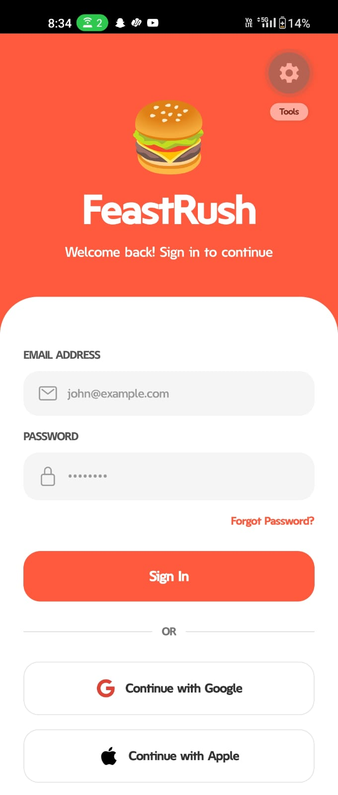
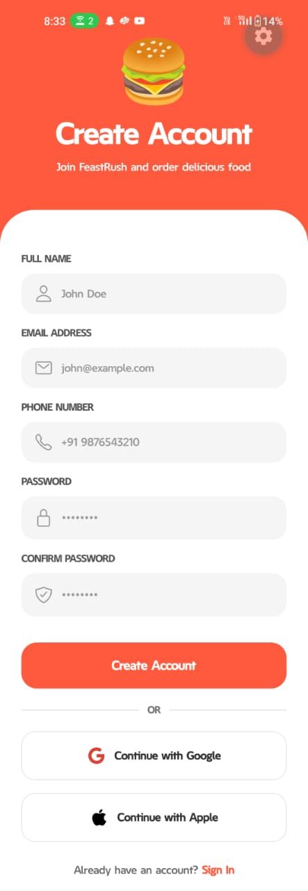
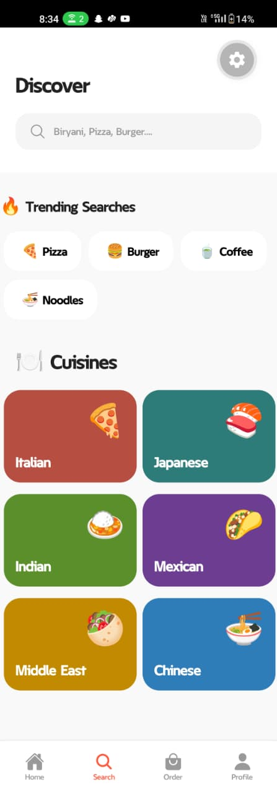
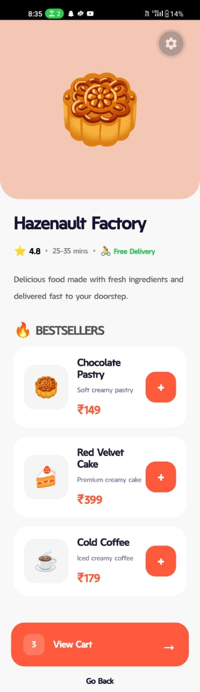
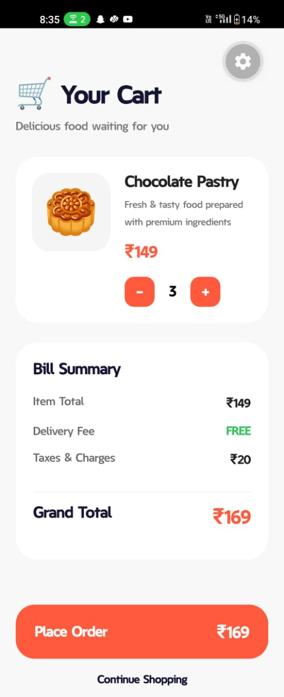
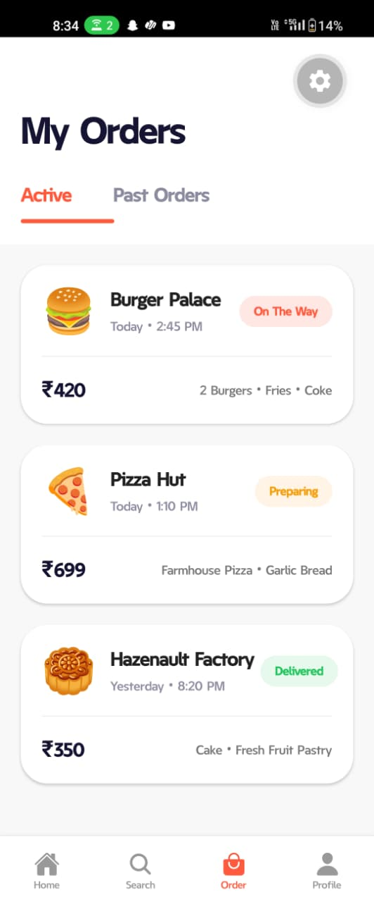
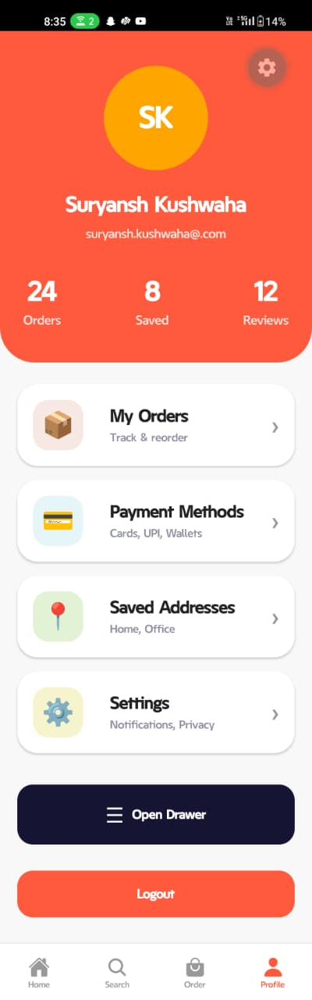

# 🍔 FoodRush - Food Delivery App

FoodRush is a modern Food Delivery Mobile Application built using **React Native**, **Expo Router**, and **TypeScript**.
The app provides a smooth food ordering experience with restaurant browsing, cart management, profile system, and custom drawer navigation.

---

# 📱 App Screenshots

## 🚀 OnBoarding Screen



---

## 🔐 Sign In Screen



---

## 📝 Sign Up Screen



---

## 🏠 Home Screen


---

## 🔎 Search Screen



---

## 🍽️ Restaurant Detail Screen



---

## 🛒 Cart Screen



---

## 📦 Orders Screen



---

## 👤 Profile Screen



---

# ✨ Features

- 🔐 Authentication Screens
- 🏠 Home Screen with Restaurants
- 🍕 Restaurant Detail Screen
- 🛒 Dynamic Cart Screen
- 📦 Order Screen
- 👤 Profile Screen
- ☰ Custom Drawer Navigation
- 📱 Bottom Tab Navigation
- ⚡ Stack Navigation
- 🎨 Modern UI Design
- 🚀 Expo Router File-Based Routing

---

# 🛠️ Tech Stack

- React Native
- Expo
- Expo Router
- TypeScript
- React Navigation
- StyleSheet API

---

# 📂 Folder Structure

```bash
src/
│
├── app/
│   ├── (drawer)/
│   │   ├── _layout.tsx
│   │   ├── order.tsx
│   │   └── profile.tsx
│   │
│   ├── (tabs)/
│   │   ├── _layout.tsx
│   │   ├── home.tsx
│   │   ├── search.tsx
│   │   ├── order.tsx
│   │   └── profile.tsx
│   │
│   ├── auth/
│   │   ├── LoginScreen.tsx
│   │   └── SignUpScreen.tsx
│   │
│   ├── restaurant/
│   │   └── _layout.tsx
│   │
│   ├── cart.tsx
│   ├── index.tsx
│   ├── onBoarding.tsx
│   └── _layout.tsx
│
├── screens/
│   └── home/
│       ├── CartScreen.tsx
│       ├── OrderScreen.tsx
│       ├── ProfileScreen.tsx
│       ├── RestaurantDetailScreen.tsx
│       └── SearchScreen.tsx
│
├── assets/
├── package.json
└── app.json
```

---

# 🧭 Navigation Structure

The app uses:

- Stack Navigation
- Bottom Tab Navigation
- Custom Drawer Navigation

---

# 📊 Navigation Diagram

```text
                    ┌────────────────┐
                    │  OnBoarding    │
                    └────────┬───────┘
                             │
                             ▼
                  ┌───────────────────┐
                  │   Bottom Tabs     │
                  └────────┬──────────┘
                           │
       ┌───────────────────┼──────────────────┐
       ▼                   ▼                  ▼
 ┌──────────┐       ┌──────────┐       ┌──────────┐
 │   Home   │       │  Orders  │       │ Profile  │
 └────┬─────┘       └──────────┘       └────┬─────┘
      │                                     │
      ▼                                     ▼
┌──────────────┐                    ┌──────────────┐
│ Restaurant   │                    │ Custom Drawer│
│ Detail Screen│                    └──────────────┘
└──────┬───────┘
       │
       ▼
 ┌──────────┐
 │   Cart   │
 └────┬─────┘
      │
      ▼
 ┌──────────┐
 │  Orders  │
 └──────────┘
```

---

# 🚀 Installation

## 1️⃣ Install Dependencies

```bash
npm install
```

## 2️⃣ Start Expo Server

```bash
npx expo start
```

## 3️⃣ Run Application

- Android Emulator
- Expo Go
- iOS Simulator

---

# 📱 Screens Included

## 🏠 Home Screen

- Restaurant cards
- Food categories
- Search section
- Promotional banner

## 🍔 Restaurant Detail Screen

- Restaurant information
- Dynamic food items
- Add to Cart button

## 🛒 Cart Screen

- Selected food items
- Dynamic pricing
- Order summary

## 📦 Orders Screen

- Active orders
- Previous orders
- Order status

## 👤 Profile Screen

- User profile
- Statistics
- Drawer menu
- Logout

---

# ☰ Drawer Features

Custom drawer contains:

- 📦 My Orders
- 🏡 Home
- 🚪 Logout

---

# 🎥 Demo Video

Add your demo video link below:

```md
▶ [Watch Demo Video](https://drive.google.com/file/d/10HiHMk3-iZgneDxbNURk6h7KvyvmTGDh/view?usp=drive_link)
```

## ✅ Demo Video Covers

1. App Launch
2. OnBoarding Screen
3. Sign In & Sign Up
4. Bottom Tab Navigation
5. Restaurant Selection
6. Restaurant Detail Screen
7. Add To Cart
8. Cart Screen
9. Place Order
10. Orders Screen
11. Profile Screen
12. Open Drawer
13. Logout Flow

---

# 📸 Suggested Demo Flow

```text
Start App
   ↓
OnBoarding Screen
   ↓
Sign In / Sign Up
   ↓
Home Screen
   ↓
Open Restaurant
   ↓
Add Food To Cart
   ↓
Open Cart
   ↓
Place Order
   ↓
Orders Screen
   ↓
Profile Screen
   ↓
Open Drawer
   ↓
Logout
```

# 👨‍💻 Developer

Developed by **Suryansh Kushwaha**

---

# 📄 License

This project is developed for educational and learning purposes.
